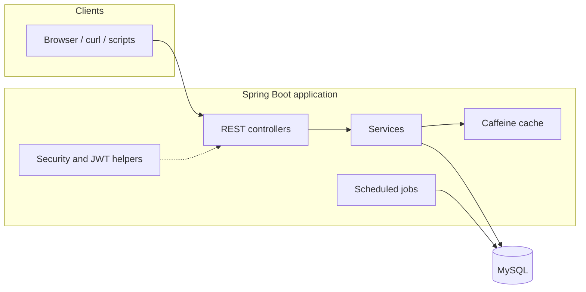
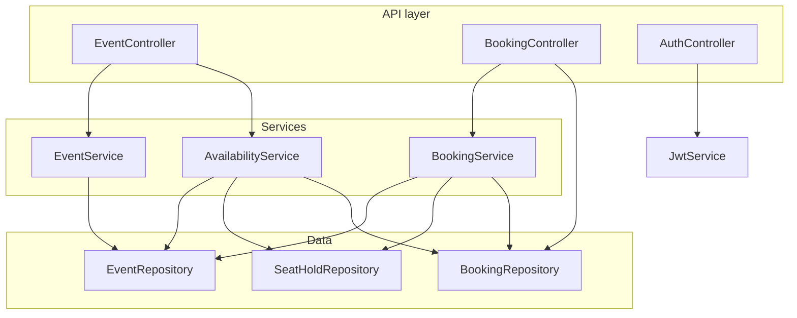
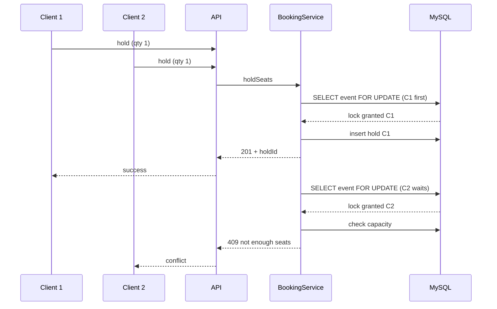

# Ticket Booking System — Architecture

This document describes how the Spring Boot backend is structured, how data moves through it, and how **correctness under concurrency** is preserved for seat inventory.

## 1. Goals

- **Hold → confirm** booking flow with a time-limited hold (TTL).
- **No overbooking** when many clients race for the last seats.
- **Soft deletes** for events; **soft cancel** for bookings (audit-friendly).
- **Readable availability** for high read load via a short-lived cache.

## 2. High-level system

- **Runtime**: single JVM process (typical deployment: one instance or horizontal scale with shared MySQL; token blacklist is in-memory today).
- **Database**: MySQL; schema is evolved by **Hibernate** from JPA entities (`ddl-auto: update`): tables, FKs, **indexes** (`@Table(indexes = …)`), and **check constraints** (`@Check` on `Event`, `Booking`, `SeatHold`). No Flyway or separate migration tool.

## 3. Layered design (package map)

| Layer | Package | Responsibility |
|--------|---------|----------------|
| **API** | `com.ticketbooking.api` | HTTP mapping, request/response DTOs (`api.dto`), global errors (`ApiExceptionHandler`, `ErrorResponse`). |
| **Domain** | `com.ticketbooking.domain` | JPA entities: `Event`, `Booking`, `SeatHold`; enums for status. |
| **Persistence** | `com.ticketbooking.repo` | Spring Data JPA repositories; custom queries for sums, locks, bulk expiry. |
| **Application logic** | `com.ticketbooking.service` | Transactions, business rules, cache eviction, exceptions (`NotFoundException`, `ConflictException`). |
| **Cross-cutting** | `com.ticketbooking.config` | `SecurityConfig`, cache (`Config` + Caffeine), `AppProperties` from `application.yml`. |
| **Security (JWT)** | `com.ticketbooking.security` | `JwtService`, `JwtAuthFilter`, `TokenBlacklist` — present for token issuance/validation patterns; HTTP access is currently **permit-all** (see below). |

## 4. Core domain model (conceptual)

- **Event** — capacity (`totalSeats`), schedule, location, `ACTIVE` vs soft-deleted.
- **SeatHold** — temporary reservation: `quantity`, `ACTIVE` / `EXPIRED` / `CONFIRMED`, `expiresAt`, optional `confirmedBookingId`.
- **Booking** — confirmed sale; can be **canceled** (soft) so seats return to the pool.

**Availability (derived)**:

`availableSeats = totalSeats − activeHeldSeats(now) − confirmedBookedSeats`

Active holds are those with status `ACTIVE` and `expiresAt > now`. Confirmed bookings count toward capacity; canceled bookings do not.

## 5. Key API flows

### 5.1 Event lifecycle

- Create / read / update via `EventService` against active events.
- **Soft delete** sets event to deleted; reads and booking actions treat it as **not found** (`NotFoundException`).

### 5.2 Hold seats

1. Client: `POST /events/{eventId}/holds` with `userId`, `quantity`.
2. `BookingService.holdSeats`:
   - Loads the **event row with `PESSIMISTIC_WRITE`** (`EventRepository.findActiveByIdForUpdate`) so concurrent holds serialize on the same event.
   - Recomputes available seats from DB (holds + bookings).
   - Enforces per-hold max (from config), **no duplicate confirmed booking** for the same `(userId, eventId)`.
   - Persists `SeatHold`, sets expiry from `app.holds.ttl-minutes`.
   - Evicts the **availability cache** for that `eventId`.

### 5.3 Confirm hold

1. Client: `POST /holds/{holdId}/confirm` with `userId`.
2. `BookingService.confirmHold`:
   - Loads hold; again locks **event** with `PESSIMISTIC_WRITE`.
   - Validates user, hold still `ACTIVE`, not expired, idempotent if already `CONFIRMED`.
   - Creates `Booking`, marks hold `CONFIRMED`, links `confirmedBookingId`.
   - Evicts availability cache.

### 5.4 Cancel booking

- `POST /bookings/{id}/cancel` — validates user, soft-cancels booking, evicts cache, returns a JSON message.

### 5.5 Availability read

- `GET /events/{id}/availability` → `AvailabilityService.getAvailability`.
- Result is **cached** (Caffeine, TTL from `app.cache.availability-ttl-seconds`).
- Writes that affect inventory **evict** that event’s cache entry so readers eventually see fresh numbers.

## 6. Concurrency and correctness

- **Single source of truth** for “how many seats are left” at write time is the **database**, after taking the **pessimistic lock** on the event row.
- The availability endpoint may be **slightly stale** while the cache is warm; **hold/confirm** still cannot overbook because they do not rely on the cache for enforcement.

## 7. Scheduled work

- **`HoldExpiryJob`** runs every **30 seconds** (`fixedDelayString = "PT30S"`), marks overdue active holds as `EXPIRED`, freeing capacity for new holds (until TTL design changes).

## 8. Security (current vs prepared)

| Piece | Role |
|--------|------|
| **`SecurityConfig`** | CSRF disabled; **all routes `permitAll()`** today. |
| **`AuthenticationManager` bean** | Used by `AuthController` for `/auth/login` wiring; a full user store / `UserDetailsService` is not part of this doc’s code path unless you add it. |
| **`JwtAuthFilter`** | Validates Bearer tokens and fills `SecurityContext` when registered on the filter chain; **not currently added** to `SecurityFilterChain` in `SecurityConfig`, so JWT is optional for future tightening. |
| **`TokenBlacklist`** | In-memory logout support for issued JWTs (single-node). |

Business rules that matter for **multi-user** scenarios use the **`userId` in the request body** (not Spring Security principals) for holds, confirms, and cancels.

## 9. Configuration (`application.yml`)

- **Datasource** — MySQL URL, user, password (env overrides: `DB_URL`, `DB_USERNAME`, `DB_PASSWORD`).
- **`app.holds`** — TTL minutes, max quantity per hold (`0` = unlimited).
- **`app.cache`** — availability cache TTL.
- **`app.security.jwt`** — issuer, TTL, secret (`JWT_SECRET`).

## 10. Error model

- **`NotFoundException`** → **404** with `ErrorResponse` (`NOT_FOUND`).
- **`ConflictException`** → **409** (`CONFLICT`) — e.g. not enough seats, wrong user, expired hold.
- **Validation** → **400** (`VALIDATION_ERROR`).

## 11. Testing and operations

- **Schema**: JPA/Hibernate `ddl-auto` (default in this project: `update`) — adjust for stricter production policies (`validate` / `none` + managed DDL).
- **Scripts** in `scripts/` — regression curls (`regression-api.sh`), last-seat contention (`contention-last-seat-race.sh`).

## 12. Technology stack (reference)

- Java 21, Spring Boot 3.3, Spring Web, Spring Data JPA, Validation, Security, Cache (Caffeine).
- MySQL (driver `mysql-connector-j`).
- JWT: JJWT.

---

*This file reflects the codebase as a layered monolith focused on transactional inventory control; extend the “Security” section when JWT is enforced on routes and when user identity moves from body fields to authenticated principals.*
